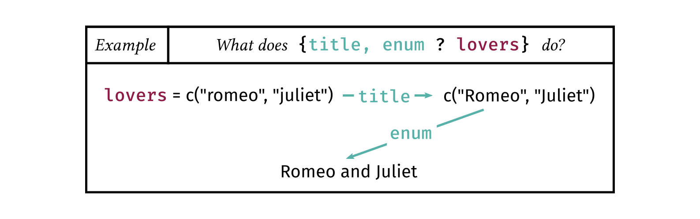
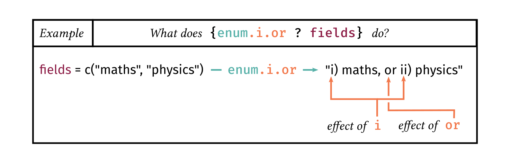

# stringmagic

The purpose of `stringmagic` is to facilitate the manipulation of character strings.

It introduces various functions to facilitate pattern detections via
[regular expression (regex) logic](https://lrberge.github.io/stringmagic/articles/ref_regex_logic.html), or to efficienty [clean character vectors](https://lrberge.github.io/stringmagic/articles/guide_string_tools.html#sec_clean) in a 
readable way. Consistently across the package, regular expressions gain [optional flags](https://lrberge.github.io/stringmagic/articles/ref_regex_flags.html) 
to monitor how the patterns should behave (fixed search? ignore case? add word boundaries? etc).
For more information, see the vignette on [string tools](https://lrberge.github.io/stringmagic/articles/guide_string_tools.html).

The main contribution of this package, and flagship function, is `string_magic` which introduces 
a new language tailored to create complex character strings. 

### Getting started with `string_magic`

`string_magic` behaves in a similar way to the well known function [glue](https://glue.tidyverse.org/).
Use curly brackets to interpolate variables: i.e to insert their value directly in the string:
```r
library(stringmagic)
x = "John" ; y = "Mary"
string_magic("Hi {x}! How's {y} doing?")
#> [1] "Hi John! How's Mary doing?"
```

Almost anything `glue` can do, `string_magic` can do, and if you're thinking about speed, they're about
as fast (see the section [Performance](#Performance)).

The difference, and originality, of `string_magic` is that you can apply any arbitrary operation to 
the interpolated variables. You want to create an enumeration? Sure. Add quotation marks? Check. 
Change the case? No problem. Sort on a substring? Of course! There are over 50 built-in operations and the
magic is that applying these operations is about as simple as saying them.

**Operations.** The syntax to add operations is as follows:


The `operations` are a comma separated sequence of keywords, each keyword being bound to a specific function. Here is an example in which we apply two operations:
```r
lovers = c("romeo", "juliet")
string_magic("Famous lovers: {title, enum ? lovers}.")
#> [1] "Famous lovers: Romeo and Juliet."
```



**Arguments.** Some operations, like `split`, require arguments. Arguments are passed using quoted text
just before the operation. The syntax is:


Let's take the example of splitting an email address and keeping the text before the domain:
```r
email = "John@Doe.com"
string_magic("This message comes from {'@'split, first ? email}.")
#> [1] "This message comes from John."
```


**Options.** Many operations accept options. These options are keywords working like flags (i.e. things
that can be turned on) and change the behavior of the current operation. 
Add options using a dot separated sequence of keywords attached to the operation:


We have seen the `enum` operation in an earlier example, let's add a couple of options to it.
```r
fields = c("maths", "physics")
string_magic("This position requires a PhD in either: {enum.i.or ? fields}.")
#> [1] "This position requires a PhD in either: i) maths, or ii) physics."
```



**Anything else?** So far we have just scratched the surface of `string_magic` possiblities.
Other features are: advanced support for pluralization, nesting, conditional operations,
grouped operations, compact if-else statements, and unlimited customization.
Here is a list of resources:

+ [an introduction to `string_magic`](https://lrberge.github.io/stringmagic/articles/guide_string_magic.html)
+ [`string_magic`'s regular operations](https://lrberge.github.io/stringmagic/articles/ref_operations.html)
+ [`string_magic`'s special operations](https://lrberge.github.io/stringmagic/articles/ref_string_magic_special_operations.html)

### Friendly errors

`string_magic` tries to be friendly to the user by providing useful error messages:
```r
x = c("Zeus", "Hades", "Poseidon")
string_magic("The {len?x} brothers: {anum?x}.")
#> Error: in string_magic("The {len?x} brothers: {anum?x}."): 
#> CONTEXT: Problem found in "The {len?x} brothers: {anum?x}.",
#>          when dealing with the interpolation `{anum?x}`.
#> PROBLEM: `anum` is not a valid operator. Maybe you meant `enum`?
#> 
#> INFO: Type string_magic(.help = "regex") or string_magic(.help = TRUE) for help.
#> Ex. of valid stuff: string_magic("Letters: {10 first, `6/2`last, ''c, 'i => e'r, upper.first ? letters}!")

string_magic("The iris species are: {unik, sort, enum ? iris[['Species']}.")
#> Error: in string_magic("The iris species are: {unik, sort, enum ?...: 
#> CONTEXT: Problem found in "The iris species are: {unik, sort, enum ? iris[['Species']}.",
#>          when dealing with the interpolation `{unik, sort, enum ? iris[['Species']}.`.   
#> PROBLEM: in the expression `iris[['Species']`, a bracket (`[`) open is not closed.
```

The cost of this feature in terms of computing time is of the order of magnitude of 50 micro seconds (of course it depends on context). 
If you're not interested in informative error messages, `.string_magic` (note the `"."` prefix) is identical to `string_magic` but avoids error handling and is then slightly faster.

### Performance

**Basic interpolation.** For regular string interpolations, the performance of `string_magic` is similar to the performance of `glue`. That is to say, the price to pay for user experience is in the ballpark of 100 micro seconds (on my -- slow -- computer). Let's have a simple benchmark:

```r
library(microbenchmark)
library(glue)

x = "Romeo" ; y = "Juliet"
microbenchmark(base    =   paste0(x, " seems to love ", y, "."),
               glue    =     glue("{x} seems to love {y}."),
               string_magic  =   string_magic("{x} seems to love {y}."),
               .string_magic =  .string_magic("{x} seems to love {y}."))
#> Unit: microseconds
#>     expr  min    lq   mean median    uq   max neval
#>     base  1.3  1.50  1.604   1.60  1.70   2.4   100
#>     glue 77.7 83.70 93.560  87.45 92.90 470.6   100
#>   string_magic 69.9 73.75 78.257  77.50 80.75 106.5   100
#>  .string_magic 43.2 45.70 50.205  48.20 52.15 137.9   100
```

The difference with the base function `base::paste0` looks impressive (it looks 50 times faster), but is in fact not really important. Both `glue` and `string_magic` processing time is due to overheads: a fixed cost that does not depend on the size of the vectors in input. Hence for large vectors or operations that run in one millisecond or more, this difference is negligible.

As you can notice, `.string_magic`, `string_magic` without error handling, is about twice faster than `glue`. But I'm not sure that sacrificing user expericence for a 50us overhead is really worth it!

**Complex operations** The function `string_magic` shines when performing complex string manipulation. The question we ask here is: how much does it cost in terms of perfomance? Let's look at the following operation:

```r
x = c("Zeus", "Hades", "Poseidon")
string_magic("The {len?x} brothers: {enum?x}.")
#> [1] "The 3 brothers: Zeus, Hades and Poseidon."
```

Although the interface is different, let's compare `string_magic` to `glue` and `paste0`:

```r
x = c("Zeus", "Hades", "Poseidon")
microbenchmark(base = paste0("The ", length(x), " brothers: ", 
                        paste0(paste0(x[-length(x)], collapse = ", "), 
                               " and ", x[length(x)]), "."),
                               
               glue = glue("The {length(x)} brothers: {x_enum}.", 
                        x_enum = paste0(paste0(x[-length(x)], collapse = ", "), 
                                        " and ", x[length(x)])),
                                        
               string_magic = string_magic("The {len?x} brothers: {enum?x}."),
               
               string_magic_bis = string_magic("The {length(x)} brothers: {x_enum}.", 
                              x_enum = paste0(paste0(x[-length(x)], collapse = ", "), 
                                        " and ", x[length(x)])))
#> Unit: microseconds
#>        expr     min       lq      mean   median      uq       max neval
#>        base   4.701   5.5510  54.37105   6.2010   6.802  4792.601   100
#>        glue  93.900 104.6015 121.23295 118.8510 129.901   219.100   100
#>      string_magic 316.701 331.3010 628.79896 351.2510 391.401 26576.501   100
#>  string_magic_bis  94.601 106.5010 118.10602 114.8015 123.301   250.301   100
```

As we can see, the processing overhead of `string_magic` specific syntax is a few hundred microseconds. 
Remember that since regular interpolation can be performed, you can always fall back to `glue`-like processing (and benefit from the same performance), as is illustrated by the last command of the benchmark.
