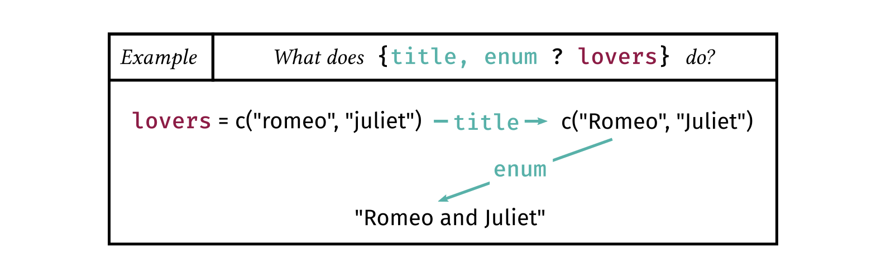
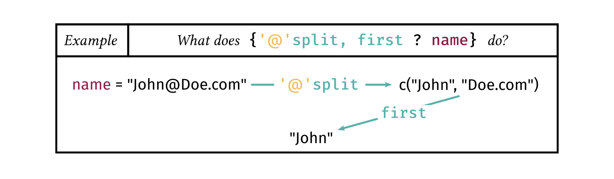
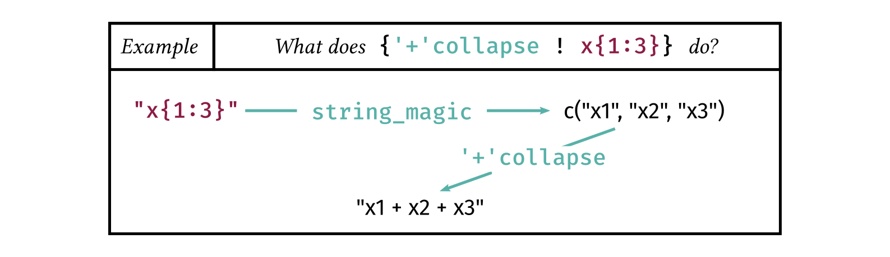

```{r setup, include = FALSE}
knitr::opts_chunk$set(
  collapse = TRUE,
  comment = "#>"
)

# we preload it to avoid ugly (was compiled with R.x.x) warnings in the doc
library(stringmagic)
```

String interpolation is a common feature of many programming languages and is
used to insert the value of variables directly into character strings.
This is useful to compose dynamic messages in a natural way. For example
`"Hello {x}"` will be interpolated as "Hello John" if `x = "John"`.

What if you want to apply some modifications to the variable before insertion?
Like normalizing the case, trimming at 40 characters, or concatenating? 
In general, you can't. Well, actually you can but have to use the language's own native tools. 
And it can be surprising how performing a few basic operations can quickly amount to lot of typing.

The aim of the package `stringmagic` is to simplify and empower string interpolation. 
With the `string_magic` function, you can apply 50+ basic operations to interpolated variables, 
interpolations can be nested, there is advanced support for pluralization, and much more.

# Basic interpolation {#sec_basic}

`string_magic` behaves in a similar way to the well known function [glue](https://glue.tidyverse.org/).
Almost anything `glue` can do, `string_magic` can do.
Use curly brackets to interpolate variables: i.e to insert their value directly in the string:
```{r}
library(stringmagic)
x = "John" ; y = "Mary"
string_magic("Hi {x}! How's {y} doing?")
```

You can either interpolate a variable that already exists, as above, or provide the variable as an argument:
```{r}
string_magic("Hi {x}! How's {y} doing?", y = "Jane")
```

So far, so good. Now let's come to `string_magic`'s originality: the ability to add operations to interpolations.

# How to add operations to interpolations {#sec_interpol}

In `string_magic` you can apply any arbitrary chain of operations to the interpolated variables. 
The syntax is as follows:


The `operations` are a comma separated sequence of keywords, each keyword being bound 
to a specific function. Here is an example in which we apply two operations:
```{r}
lovers = c("romeo", "juliet")
string_magic("Famous lovers: {title, enum ? lovers}.")
```



As shown, `title` puts to title case and `enum` creates an enumeration (i.e. turns
the elements of a vector into a single character string). These two operations are applied 
sequentially from left to right to the variable `lovers`. 
You can stack as many operations as you wish.

Here is a short list of common operations: `enum` to enumerate; `lower`, `upper` and `title` to change the case;
`unik` to create the vector of unique elements; `n`, `N` to format integers;
`split` to break the string with respect to a pattern; `replace` to make pattern replacements; `collapse`
to concatenate the strings; `first` to select the first elements; `q`, `Q` and `bq` for quoting; `align` to
align the elements.

The question mark defines the separation between the operations and the expression. After 
the question mark, you can use any valid R expression. For example:
```{r}
string_magic("The max of each variable is: {enum ? sapply(iris[, 1:4], max)}.")
```

## Adding arguments to operations

Many operations use arguments. Arguments are passed using quoted text
just before the operation. The syntax is:


Let's take the example of splitting an email address and keeping the text before the domain:
```{r}
email = "John@Doe.com"
string_magic("This message comes from {'@'split, first ? email}.")
```



In this example, `split` breaks `"John@Doe.com"` with respect to `"@"`, then `first` keeps 
only the first element. Almost all operations have default values. For `split`, the 
default value is a single space. The operation `first` also accepts arguments and its 
default is 1. Let's change it to keep the first two values:

```{r}
string_magic("The first two species are: {unik, '2'first, q, enum ? iris$Species}.")
```

### Alternative ways to pass arguments 

There are three ways to pass arguments to operations:


The first, canonical way, is using quotes like in the examples of the previous section. 

The second way uses a space to separate the 
argument from the operation and hence forbids any space in the argument.
```{r}
string_magic("The first five sepal lengths are: {5 first, enum ? iris$Sepal.Length}.")
```

The third way uses backticks. Passing arguments with backticks requests an evaluation
of the argument, using the variables defined in the calling environment. Let's
redo the previous example with argument evaluation:
```{r}
n = 5
string_magic("The first {N?n} sepal lengths are: {`n`first, enum ? iris$Sepal.Length}.")
```


## Adding options to operations

Options are keywords working like flags (i.e. things
that can be turned on) and change the behavior of the current operation. 
Many operations acccept options.
Add options using a dot separated sequence of keywords attached to the operation:


We have seen the `enum` operation in an earlier example, let's add a couple of options to it.
```{r}
fields = c("maths", "physics")
string_magic("This position requires a PhD in either: {enum.i.or ? fields}.")
```


As just seen, the option `i` triggers an enumeration with roman lower case numbers, and option
`or` finishes the enumeration with an `or` instead of an `and`. The order of the options
does not matter. Note that there is partial matching on the options, so that long 
option names can be shortened. 

Let's have another example where we wish to add upper cases but only for the first letter
of each sentence. To do this, we use the option `sentence` of the operation `upper`:
```{r}
oversight = "hey, you forgot. forgot what? forgot the capital letters!"
string_magic("{upper.sentence ? oversight}")
```

**Wrapping up.** With `string_magic` you can perform string interpolations *à la* `glue` and 
also empower these interpolations by adding operations on-the-fly (see the [operations reference](https://lrberge.github.io/stringmagic/articles/ref_operations.html)). 
This can take us a long way already. We are presenting next how you can nest interpolations and follow with
an introduction to pluralization.

# Nesting interpolations

In `string_magic`, you have two types of interpolations: regular interpolations (the ones we have covered so far),
and verbatim evaluation. The syntax of vertatim interpolations is as follows:


Anything after the exclamation mark is treated as verbatim: i.e. anything coming 
before the closing bracket is treated as a simple character string. Let's give an example:

```{r}
string_magic("Hello {upper ! world}.")
```

In that case, since `world` is placed after the excalamation mark (and not a question mark!), 
the character string `"world"` is passed to the operation `upper`, leading to the result.

The main interest of verbatim evaluations is nesting. Indeed, the function `string_magic` is always applied 
to the verbatim character string *before* any operation is applied. This means that 
interpolations within the verbatim text will be resolved. For example, let's create the 
sum from `x1` to `x3`:
```{r}
string_magic("y = {' + 'collapse ! x{1:3}}")
```



Now let's tackle a more challenging example: write a polynomial of order `n`. It should be
of the form `a + bx + cx^2 + etc`.

```{r}
n = 2
string_magic("poly({n}): {' + 'collapse ! {letters[1 + 0:n]}x^{0:n}}")
```

Let's break it down. The verbatim expression (the one following the exclamation mark),
here `"{letters[1 + 0:n]}x^{0:n}"`, is evaluated with `string_magic`.
`string_magic("{letters[1 + 0:n]}x^{0:n}")` leads to the vector `c("ax^0", "bx^1", "cx^2")`.

The operation `' + 'collapse` then concatenates that vector with `' + '`.
This value is then appended to the previous string.

We can refine by adding a cleaning operation in which we replace `"x^0"` and `"^1"` 
by the empty string. Let's do it:

```{r}
n = 4
string_magic("poly({n}): {' + 'c, 'f/x^0, ^1'clean ! {letters[1 + 0:n]}x^{0:n}}")
```

To achieve our goal, we used the operation `clean` which replaces
comma separated regular expression patterns (of the form `'flags/pat1, pat2, etc'`) with the empty
string. We also used the flag `f` (standing for 'fixed') to suppress the regular expression
meaning of the patterns (because `'^'` has a specific meaning in regexes) -- see the 
[vignette on flags](https://lrberge.github.io/stringmagic/articles/ref_regex_flags.html) for more information.
Finally, you can notice that the operation `collapse` has a single letter alias.


# Pluralization: A brief introduction

Pluralization is about the automatic writing of a message in singular or plural form, depending on context.
This feature is especially important for developers who often need to write human readable 
messages to inform the user. `string_magic` has an extensive support for pluralization, which we 
briefly introduce here. 

The syntax for pluralization is as follows:


After the opening bracket, to trigger pluralization use an hashtag (`#`) or a dollar sign (`$`) followed
by plural operations. There is two kinds of pluralization: either on the value of the expresison (the `#`),
either on its length (the `$`). Here is an example of pluralization on length with three operations:
```{r}
friends = c("Piglet", "Eeyore")
string_magic("My best friend{$s, are, enum ? friends}. Who am I?")

friends = "Mercutio"
string_magic("My best friend{$s, are, enum ? friends}. Who am I?")
```
As you can see, the name of the operations is intuitive: `s` to add an "s" when plural, 
`are` to write `is` when singular and `are` when plural (the operation `is` is identical), 
and `enum` to create an enumeration. 

Note that in plural interpolations the expression over which to pluralize is optional. It is 
automaically deduced from the previous interpolations. 
Now let's illustrate this behavior with a pluralization on value:
```{r}
nFiles = 6
string_magic("Warning: {N?nFiles} file{#s, is} corrupted.")

nFiles = 1
string_magic("Warning: {N?nFiles} file{#s, is} corrupted.")
```

The first interpolation is a regular one. The second one, `{#s, is}`, deduces the 
expression over which to pluralize from this previous interpolation.

This was only an introduction. To have more information on pluralization,
please see the [dedicated section](https://lrberge.github.io/stringmagic/articles/ref_string_magic_special_operations.html#sec_pluralization).


# Escaping and special cases {#sec_special_cases}

We end this introduction with a few special cases. 

### Escape brackets

The opening and closing brakets, `{}`, are special characters 
and cannot be used as regular text. 
To bypass their special meaning, you need to escape them with a double backslash.

You only need to escape the special delimiters which the algorithm is currently looking for.
For example, if we escape the opening delimiter, we don't need to escape the closing one:
```{r}
# Here opening delimiter is escaped: the closing delimiter has no special meaning
string_magic("open = \\{, close = }")
```

You need to escape the closing delimiter only when the algorithm is looking for it. 
In the following example, we need to escape the closing curly bracket to treat it as a regular character:
```{r}
string_magic("Here are closing brackets: {5 times.c ! \\}}")
```

Alternatively, use the argument `.delim` to change the delimiters:
```{r}
string_magic("Here I {interpolate} with .[this] ", .delim = ".[ ]", this = ".[]")
```

When using delimiters composed of two or more characters, like in the previous example, 
to escape it you need to add a double backslash before the first character (i.e. right before the
delimiter):
```{r}
string_magic("Here I {interpolate} with \\.[] ", .delim = ".[ ]")

# another example with {{ }}  as delimiter
string_magic("I {{what}} with \\{{ }} ", .delim = "{{ }}", what = "interpolate")
```

Another way is to pass a character string in an expression.
Indeed, since `{expr}` evaluates `expr`, if `expr` is a character string, it will stay untouched. 
```{r}
string_magic("I {'can {write} {{what}} I want'}")
```

### Other escapes 

In the few operations expecting a semi-colon (*if-else* and certain 
operations in *pluralization*), it can also be escaped with a double backslash.

```{r}
# if-else statement with semi-colon
is_c = TRUE
string_magic("{&is_c ; int i = 1\\; ; i = 1}")

is_c = FALSE
string_magic("{&is_c ; int i = 1\\; ; i = 1}")
```

### How to use a regular `!` in interpolations?

In interpolations, the exclamation mark (`!`) signals a verbatim expression. 
But what if you use it to mean the logical operation *not* in an operation-free interpolation? 
In that case, you need a hack: use a question mark (`?`) first to indicate to the
algorithm that you want to evaluate the expression. 

Ex.4: using the `?` hack to use `!` as a logical operation.
```{r}
string_magic("{!TRUE} is {?!TRUE}")
```


