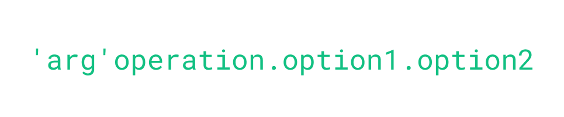

String interpolation is a common feature of many programming languages and is
used to insert the value of variables directly into character strings.
This is useful to compose dynamic messages in a natural way. For example
`"Hello {x}"` will be interpolated as "Hello John" if `x = "John"`.

What if you want to apply some modifications to the variable before insertion?
Like normalizing the case, trimming at 40 characters, or concatenating? 
In general, you can't. Well, actually you can but have to use the language's own native tools. 
And it can be surprising how performing a few basic operations can quickly amount to lot of typing.

The aim of the package `stringmagick` is to simplify and empower string interpolation. 
With the `smagick` function, you can apply 50+ basic operations to interpolated variables, 
interpolations can be nested, there is advanced support for pluralization, and much more.

```{r setup, include=FALSE}
knitr::opts_chunk$set(
  echo = TRUE,
  collapse = TRUE, 
  comment = "#>"
)

# we preload it to avoid ugly (was comiled with R.x.x) warnings in the doc
library(stringmagick)
```

Before moving on, we set the global option `.smagick.class` to `TRUE` such that 
the character vectors produced by `smagick` are displayed nicely in this vignette.
```{r}
setSmagick(.smagick.class = TRUE)
```

# Motivating examples and advice for reading

Here's a few things the algorithm can do (don't worry if it looks like gibberish when first
discovering it: it will make sense later!):
```{r}
library(stringmagick)
name = "john doe"
smagick("Hi {title ? name}.")

cars = row.names(mtcars)
print(cars)
smagick("I like cars starting with C like {'i/^c'get, x, unik, enum.or ? cars}.")

friends = c("Piglet", "Eeyore")
smagick("My best friend{$s, are, enum ? friends}. Who am I?")

friends = "Mercutio"
smagick("My best friend{$s, are, enum ? friends}. Who am I?")
```

If you discover this package, since it's a lot of content, here's some advice:

- read the first sections completely ([regular interpolation](#sec_basic), 
[interpolation with operations](#sec_interpol), [verbatim and nesting](#sec_verbatim), and 
[the operations syntax](#sec_syntax)). They're short.
- skim the [operations reference](#sec_operations_reference)

And you should be good to go for some basic usage. 

**Tip:** don't be afraid to try out some operations at random (from memory), 
the error messages will remind you the available operations. 
You can also use the argument `help = TRUE` to get 
interactive help (use `help = "regex"` to perform a regex search on the full doc!).
Finally, `smagick("--help")` gives you a compact help.

Once you're a bit comfortable, here are extra sections of interest:

- [group-wise operations](#sec_group_wise)
- [conditional operations](#sec_conditional)
- [the if-else operator](#sec_ifelse)
- [pluralization](#sec_pluralization): must read if interested in the topic
- [escaping and special cases](#sec_special_cases)
- [creating your own operations](#sec_creation): rather advanced

# Basic interpolation {#sec_basic}

To interpolate a variable, say `x`, simply use `{x}`. 

```{r hello-world}
x = "world"
smagick("hello {x}")
```

As we can see, anything in curly brackets gets interpolated. This behavior is similar
to the well known function [glue](https://glue.tidyverse.org/) from the tidyverse.

Now let's come to what `smagick` really brings to the table.

# Interpolation with operations: Principle {#sec_interpol}

To any interpolation you can add operations. Operators have the syntax:

```{r, echo = FALSE, fig.alt = 'Figure with the string `smagick("{operation ? expression}\")`. It is color coded to emphasize that the curly braces start and end the string interpolation. The word operation and expression are colored to show that they are special objects.'}
knitr::include_graphics("Operations.png")
```

Let's take the example of the previous section and 
say we want to display "hello W O R L D". 
This means upper casing all letters of the interpolated variable and adding a space between 
each of them. Let's do it:

```{r hw-ops}
smagick("hello {upper, ''s, c ? x}")
```

Now let's explain what happened. Within the `{}` *box*, we first write a set of 
operations, here `upper, ''s, c`, then add `?` and finally write 
the variable to interpolate, `x`.  The operations (detailed in [the reference section](#sec_operations_reference)) 
are `upper`, to upper-case all letters, `''s`: to split
with the empty string, `c`: to concatenate the vector that was just split with spaces (`' '`).
The question mark means that the expression coming after it is to be evaluated 
(this is opposed to the exclamation mark presented in the next section).

The syntax is always the same: `{operations ? expression}`, where the operations section is a *comma separated* list of operations.
These operations are of the form `'arg'op`, with `arg` the argument to the operator  `op`. These operations are performed sequentially from left to right. 

Some operations, like `upper`, accept options. You attach options to an operation 
with a dot followed by the option name. Formally: `op.option1.option2`, etc. Example:

```{r ex-ops}
x = "hi there. what's up? fine."
smagick("He said: {upper.sentence, Q ? x}")
```

The general syntax for operations that take an argument and have option flags is: 
```{r, echo = FALSE, fig.alt = "Figure with the string `'arg'operation.option1.option2`. This image is meant to show the general syntax available for operations"}

```

Both operators and options are partially matched. So `smagick("He said: {up.s, Q ? x}")` would 
also work. You have more details on the operations syntax in the [syntax section](#sec_syntax). 

# Verbatim interpolation and nesting: Principle {#sec_verbatim}

Instead of interpolating a variable, say `x`, with `{x}`, you can use an exclamation 
mark to trigger verbatim evaluation. For example `smagick("hello {!x}")` would lead to "hello x". 
(To use `!` as a regular logical operator, see the [section on special cases](#sec_special_cases).)
Please hold on a little bit to see the point.

Verbatim evaluation is a powerful way to apply operations to plain text. For example:

```{r}
smagick("hello {upper, ''s, c ! world}")
```

Before moving on, a necessary detail. The spaces surrounding the exclamation mark are non necessary,
but when one space is present on both sides of the `!`, then the verbatim
expression only begins after the space. This is illustrated below
```{r}
# The decorative space in verbatim mode
#                  v                      => adds a space before 'hi'
smagick("{upper, Q! hi}", 
        #         v v                     => no space added (ie decorative space)
        "{upper, Q ! hi}", 
        #         v vv                    => adds a space before 'hi'
        "{upper, Q !  hi}", .sep = "\n")
        
```

### Nesting

The main advantage, and real power, of verbatim evaluations is *nesting*. Anything in a verbatim 
expression becomes evaluated with the function `smagick`.
This means that any *box* will be evaluated as previously described. 

Let's give an example. You want to write the expression of a polynomial of order `n`: `a + bx + cx^2 + etc`.
You can do that with nesting:

```{r}
n = 2
smagick("poly({n}): {' + 'c ! {letters[1 + 0:n]}x^{0:n}}")
```

How does it work? The verbatim expression (the one following the exclamation mark),
here `"{letters[1 + 0:n]}x^{0:n}"`, is evaluated with `smagick`.
`smagick("{letters[1 + 0:n]}x^{0:n}")` leads to the vector `c("ax^0", "bx^1", "cx^2")`.

The operation `' + 'c` then concatenates (or collapses) that vector with `' + '`.
This value is then appended to the previous string.

We could refine by adding a cleaning operation in which we replace `"x^0"` and `"^1"` 
by the empty string. Let's do it:

```{r}
n = 4
smagick("poly({n}): {' + 'c, 'f/x^0, ^1'clean ! {letters[1 + 0:n]}x^{0:n}}")
```

We obtain the desired result. 
Note that the `clean` operation is explained in the [operations reference section](#op_clean).

# Regular operations: General syntax {#sec_syntax}

As seen in the previous sections, within a *box* (i.e. `"{}"`), 
multiple operations can be performed.
We can do so by stacking the operations in a comma separated enumeration.
Operations can have arguments, and operations can also have options. The general 
syntax, with argument and options, is:

```{r, eval=FALSE}
smagick("{'arg1'op1.optionA.optionB, arg2 op2.optionC, 
          `arg3`op3, 51op4, op5 ? x}")
```

Any blanks after the commas are discarded (inclusing tabs and newlines) so the chain
of operations can be written across several lines, as above.

You can include arguments in four different ways:

1. inside single or double quotes just before the operation name (`arg1` above), 
1. verbatim, separated with a space, just before the operation name (`arg2` above), 
1. inside bactick quotes, which will trigger evaluation of the argument from the environment (`arg3` above),
1. when the argument is an integer it can be juxtaposed to the opeation name (like in `op4` above).

The options are always dot separated and attached to the operation name, they are 
specific to each operation.

Both the operation name and the option names are partially matched. This means,
for example, that command `"upper.first"` is equivalent to `"up.f"`.

Here are examples for each types of arguments:
```{r}
# quoted argument
smagick("y = {'x'paste, ' + 'c ? 1:2}")

# verbatim argument, space separated
smagick("y = {x paste, ' + 'c ? 1:2}")

# evaluated argument
x = "z"
smagick("y = {`x`paste, ' + 'c ? 1:2}")

# digits accolated to the operator
smagick("y = {0paste, ' + 'c ? 1:2}")

# options `bq` (back quote) and `a` passed to operator `enum`
smagick("y = the sum of {'x'paste, enum.bq.a ? 1:2}")
```

A few operators have two arguments. Pass multiple arguments using a pipe as follows:
```{r, eval = FALSE}
smagick("{'arg1|arg2'op, 'arg1||arg2'op ? x}")
```
You can escape the meaning of the pipe as a separator with a double backslash. 
Some operators accept a double pipe which modifies the behavior of the second argument.
Here is an example:
```{r}
x = "Quels sont ces serpents qui sifflent sur vos têtes?"
# let's shorten this
smagick("Oreste: {s, '4|..'k, c, Q ? x}")

rome = c("Rome qui t'a vu naître et que ton coeur adore",
         "Rome enfin, que je hais parce qu'elle t'honore!")
# the double pipe triggers a different behavior in this operator
smagick("Camille: {s, '4||..'k, c, Q ? rome}")
```

# Regular operations: Reference {#sec_operations_reference}

This section references all `smagick`'s regular operations.

## Basic string operations

This section describes some of the most common string operations: extracting, 
replacing, collapsing, splitting, etc. Because they are so common, many of these 
operations have a name composed of just one letter.
These functions accept generic flags ("ignore", "fixed", "word") in their patterns (syntax: "flags/pattern"). 
For more information on regex flags, see the [dedicated section](https://lrberge.github.io/stringmagick/articles/string_tools.html).

### s, S, split, Split

Splits the string according to a pattern. The three operations have different defaults: `' '` 
for `s` and `split`, and `',[ \t\n]*'` for `S` and `Split` (i.e. comma separation). 

When character strings are split, their identity is kept in memory 
so that group-wise operations can be applied. See the [section on group-wise operations](#sec_group_wise).
```{r}
# 'S' with its default (comma separation)
smagick("{S ! romeo, juliet}")

# result with 's' is different
smagick("{s ! romeo, juliet}")

# with argument: 's' and 'S' are identical
# note the flag 'fixed' (`f/`) to remove regex interpretation
smagick("{'f/+'s, '-'c ! 5 + 2} = 3")

# group wise operations (here `~(sort, c)`, see dedicated section)
prince_talk = c("O that this too too solid flesh would melt",
                "Thaw, and resolve itself into a dew!",
                "Or that the Everlasting had not fix'd",
                "His canon 'gainst self-slaughter!")
smagick("Order matters:\n{s, ~(sort, c), fill.c, lower, upper.sentence,
                          Q, '\n'c ? prince_talk}")
```

### c, C, collapse, Collapse

To collapse (or concatenate) multiple strings into a single one. The three operations are 
identical, only their defaults change. The default is `' '` for `c` and `collapse`, 
and `', | and '` for `C` and `Collapse`.
The syntax of the argument is `'s1'` or `'s1|s2'`. s1 is the string used to concatenate 
(think `paste(x, collapse = s1)`). In arguments of the form `'s1|s2'`, `s2` will be 
used to concatenate the last two elements. 
When the elements of the vector are split, each original item is kept in memory 
so that group-wise operations can be applied. See the section on group-wise operations.

```{r}
# regular way
x = 1:4
smagick("And {' and 'c ? x}!")

# with s2
smagick("Choose: {', | or 'c ? 2:4}?")

# default of C: enumeration
wines = c("Saint-Estephe", "Margaux")
smagick("I like {C?wines}.")

# default of c: space concatenation
smagick("{s, '.{5,}'get, c ! I don't like short words}")
```

### extract, x, X

Extracts the first or multiple patterns from a string. Default argument is `'[[:alnum:]]+'`.
Command `"extract"` accepts the option `"first"`, and 
`"x"` and `"X"` accept no option. `x` is an alias for `extract.first` and `X` for `extract`.
Use the option `"first"` to extract only the first match for each string.

When patterns are extracted, the identity of each original character string is kept in memory 
so that group-wise operations can be applied. See the [section on group-wise operations](#sec_group_wise).
```{r}
x = c("margo: 32, 1m75", "luke doe: 27, 1m71")
smagick("{'^\\w+'extract ? x} is {'\\d+'extract.first ? x}")

# illustrating multiple extractions
# group-wise operation (~()) is detailed in its own section
x = c("Combien de marins, combien de capitaines.",
      "Qui sont partis joyeux pour des courses lointaines,",
      "Dans ce morne horizon se sont évanouis !")
smagick("Endings with i: {'i\\w*'extract, ~(', 'c), enum.1 ? x}.")

x = c("6 feet under", "mahogany")
# single extraction
smagick("{'\\w{3}'x ? x}")
# multiple extraction
smagick("{'\\w{3}'X ? x}")
```

### r, R, replace

Replaces a pattern with a string. The three operators are identical and have no default.
Accepts the option `"first"`.
The syntax is `'flags/old'` or `'old => new'` with `'old'` the pattern to find and `new` the 
replacement. `flags/` are optional regex flags. The default for `new` is 
the empty string. On top of regular regex flags, this operation also accepts 
the flag `"total"` which instructs to replace the fulll string in case the pattern is found.

If the option `"single"` is provided, only a single substitution is performed (the first pattern is replaced). 
That is, the function `base::sub` is used instead of `base::gsub`.
```{r}
# regex without replacement (ie removing)
smagick("{'e'replace ! Where is the letter e?}")

# regex with replacement
smagick("{'(?<!\\b)e => a'replace ! Where is the letter e?}")

# with option "single"
smagick("{'(?<!\\b)e => a'replace.single ! Where is the letter e?}")

# we replace the full string with the flag total (`t/`)
x = c("Where is the letter e?", "Not this way!")
smagick("{'t/e => here!'r ? x}")
```

### clean {#op_clean}

Replaces a pattern with a string. Similar to the operation `r`, except that here the comma is
a pattern separator. The argument is of the form `"flags/pattern1, pattern2 => replacement"`. 
See detailed explanations in [`str_clean()`](https://lrberge.github.io/stringmagick/articles/string_tools.html#sec_clean). 

```{r}
# we use the fixed pattern to remove the regex meaning
smagick("{'f/[, ]'clean ! x[a]}")
```

### get

Restricts the string vector to only the values respecting a pattern. This operation has no default.
Accepts the options `"equal"` and `"in"`.
By default it uses the same syntax as [`str_get()`](https://lrberge.github.io/stringmagick/articles/string_tools.html#detect_funs) 
so that you can use regex flags and 
include logical operations between regex patterns with `' & '` and `' | '`.
If the option `"equal"` is used, a simple string equality with the argument is tested (hence
no flags are accepted). If the option `"in"` is used, the argument is first split with respect to commas
and then set inclusion is tested. 

```{r}
x = row.names(mtcars)
#  we only keep models containing "Merc" and ending with a letter ([[:alpha:]]$)
smagick("Mercedes models: {'Merc & [[:alpha:]]$'get, '^.+ 'r, C ? x}.")

models = c("Merc 230", "Merc 450SE", "Merc 480")
# we only ekep the ones in the set
smagick("Mercedes models: {`models`get.in, C ? x}.")
```

### is

Detects if a pattern is present in a string, returns a logical vector. This operation has no default.
Mostly useful as the final operation in a [`str_ops()`](https://lrberge.github.io/stringmagick/articles/string_tools.html#sec_ops) call.
By default it uses the same syntax as [`str_is()`](https://lrberge.github.io/stringmagick/articles/string_tools.html#detect_funs) 
so that you can use regex flags and 
include logical operations between regex patterns with `' & '` and `' | '`.
If the option `"equal"` is used, a simple string equality with the argument is tested (hence
no flags are accepted). If the option `"in"` is used, the argument is first split with respect to commas
and then set inclusion is tested. 
```{r}
x = c("Mark", "Lucas")
# note that we use the flag `i/` to ignore the case
smagick("Mark? {'i/mark'is, C ? x}")
```

### which

Returns the index of string containing a specified pattern. With no default, can be applied
to a logical vector directly. 
By default it uses the same syntax as [`str_which()`](https://lrberge.github.io/stringmagick/articles/string_tools.html#detect_funs) 
so that you can use regex flags and 
include logical operations between regex patterns with `' & '` and `' | '`.
If the option `"equal"` is used, a simple string equality with the argument is tested (hence
no flags are accepted). If the option `"in"` is used, the argument is first split with respect to commas
and then set inclusion is tested. 
Mostly useful as the final operation in a [`str_ops()`](https://lrberge.github.io/stringmagick/articles/string_tools.html#sec_ops) call.
```{r}
x = c("Mark", "Lucas", "Markus")
# note that we use the flag `i` to ignore the case and `w` to add word boundaries
smagick("Mark is number {'iw/mark'which ? x}.")
```

## Operations changing the length or the order {#subsec_op_length}

### first

Keeps only the first `n` elements. 

```{r}
smagick("First 3 mpg values: {3 first, C ? mtcars$mpg}.")

# you could have done the same with regular R in the expression...
smagick("First 3 mpg values: {C ? head(mtcars$mpg, 3)}.")

# ...but not in the middle of an operations chain
smagick("First 3 integer mpg values: {'!f/.'get, 3 first, C ? mtcars$mpg}.")
```

Negative numbers as argument remove the 
first `n` values. You can add a second argument in the form `'n1|n2'first` in which case the first `n1` and last
`n2` values are kept; `n1` and `n2` must be positive numbers.

```{r}
smagick("Letters in the middle: {13 first, 5 last, C ? letters}.")

smagick("First and last letters: {'3|3'first, C ? letters}.")

smagick("Last letters: {-21 first, C ? letters}.")
```

### K

Keeps only the first `n` elements; has more options than `first`. The syntax is `'n'K`, 
`'n|s'K`, `'n||s'K`. `n` provides the number of elements to keep. If `s` is provided and the number of 
elements are greater than `n`, then in `'n|s'` the string `s` is added at the end, and
if `'n||s'` the string `s` replaces the nth element.
The string `s` accepts specials values:
  + `:n:` or `:N:` which gives the total number of items in digits or letters (N)
  + `:rest:` or `:REST:` which gives the number of elements that have been truncated in digits or letters (REST)

```{r}
# basic use
smagick("First 3 letters: {'3'K, q, C ? letters}.")

# advanced use: using the extra argument
smagick("The letters are: {q, '3|:rest: others'K, C ? letters}.")
```

### last

Keeps only the last `n` elements. Negative numbers as argument remove the 
last `n` values.
```{r}
smagick("Last 3 mpg values: {3 last, C ? mtcars$mpg}.")

smagick("Removing the 3 last elements leads to {-3 last, C ! x{1:5}}.")
```

### sort

Sorts the vector in increasing order. Accepts an optional argument and the option `"num"`. 
```{r}
x = c("sort", "me")
# basic use
smagick("{sort, c ? x}")
```
If an argument is provided, it must be a regex pattern that will be applied to
the vector using [`str_clean()`](https://lrberge.github.io/stringmagick/articles/string_tools.html#sec_clean). 
The sorting will be applied to the modified version of the vector
and the original vector will be ordered according to this sorting. 
```{r}
# first modifying the string before sorting
# here the regex first removes the first word, meaning that we sort on the last names
x = c("Jon Snow", "Khal Drogo")
smagick("{'.+ 'sort, C?x}")
```

The option `"num"` sorts over a numeric version 
(with silent conversion) of the vector and reorders the original vector accordingly. 
Values which could not be converted are last.
```{r}
x = "Mark is 34, Bianca is 55, Odette is 101, Julie is 21 and Frank is 5"
# sort on the "character string" number
smagick("{', | and 's, '\\D'sort, C ? x}")

# we extract the numbers, then convert to numeric, then sort
smagick("{', | and 's, '\\D'sort.num, C ? x}")
```
**Important note**: the sorting operation is applied before any character conversion.
If previous operations were applied, it is likely that numeric data were transformed to character.
```{r}
# note the difference
x = c(20, 100, 10)
# sorting on numeric
smagick("{sort, ' + 'c ? x}")
# sorting on character since 'n' operation transformed the vector to character
smagick("{n, sort, ' + 'c ? x}")
```

### dsort

Sorts the vector in decreasing order. It accepts an optional argument and 
the option `"num"`. See the operation `"sort"` for a description of the argument and the option.
```{r}
smagick("5 = {dsort, ' + 'c ? 2:3}")
```

### rev

Reverses the vector.
```{r}
smagick("{rev, ''c ? 1:3}")
```

### unik

Makes the string vector unique. 
```{r}
smagick("Iris species: {unik, upper.first, C ? iris$Species}.")
```

### each

Repeats each element of the vector `n` times. Option `"c"` then collapses the full vector 
with the empty string as a separator. 
```{r}
# note: operation `S` splits splits wrt to commas (default behavior)
smagick("{S!x, y}{2 each ? 1:2}")

# illustrating collapsing
smagick("Large number: 1{5 each.c ! 0}")
```

### times

Repeats the vector sequence `n` times. Option `"c"` then collapses the full vector 
with the empty string as a separator. 
```{r}
smagick("What{6 times.c ! ?}")
```

### rm

Removes elements from the vector. Options: `"empty"`, `"blank"`, `"noalpha"`, `"noalnum"`, `"all"`.
The *optional* argument represents the pattern used to detect strings to be deleted. 
```{r}
x = c("Luke", "Charles")
smagick("{'i/lu'rm ? x}")
```

By default it removes empty strings. 
Option `"blank"` removes strings containing only blank characters (spaces, tab, newline).
Option `"noalpha"` removes strings not containing letters. Option `"noalnum"` removes strings not 
containing alpha numeric characters. Option `"all"` removes all strings (useful in conditions, see 
the dedicated section). If an argument is provided, only the options `"empty"` and `"blank"` are available.

```{r}
x = c("I want to enter.", "Age?", "21.")
smagick("Nightclub conversation: {rm.noalpha, c ! - {x}}")
```

### nuke

Removes all elements, equivalent to `rm.all` but possibly more explicit. 
Useful in conditions, see the dedicated section.
```{r}
x = c(5, 7, 453, 647)
# here we use a condition: see the dedicated section for more information
smagick("Small numbers only: {if(.>20 ; nuke), C ? x}.")
```

### insert

Inserts a new element to the vector. Options: `"right"` and `"both"`. Option `"right"` adds
the new element to the right. Option `"both"` inserts the new element on the two sides of the vector.

```{r}
smagick("{'3'insert.right, ' + 'c ? 1:2}")
```

## Formatting operations
 
### lower

Lower cases the full string.
```{r}
x = "MesSeD uP CaSe"
smagick("from a {x} to {lower?x}")
```

### upper

Upper cases the full string. Options: `"first"` and `"sentence"`.
Option `"first"` upper cases only the first character. Option `"sentence"`
upper cases the first letter after punctuation. 

```{r}
x = "hi. how are you? fine."
smagick("{upper.sentence ? x}")
```

### title

Applies a title case to the string. Options: `"force"` and `"ignore"`.
Option `"force"` first puts everything to lowercase before applying the title case. 
Option `"ignore"` ignores a few small prepositions ("a", "the", "of", etc).

```{r}
x = "bryan is in the KITCHEN"

# default: respects upper cases
smagick("{title ? x}")

# force: force to title case
smagick("{title.force ? x}")

# ignore: ignores small prepositions
smagick("{title.force.ignore ? x}")
```

### ws

Normalizes whitespaces (WS). It trims the whitespaces on the edges and transforms any succession 
of whitespaces into a single one. Can also be used to further clean the string with its options. 
Options: `"punct"`, `"digit"`, `"isolated"`. Option `"punct"` cleans the punctuation. Option `"digit"` cleans digits.
Option `"isolated"` cleans isolated letters. WS normalization always come after any of these options.
**Important note:** punctuation (or digits) are replaced with WS and **not** 
the empty string. This means that `smagick("ws.punct ! Meg's car")` will become `"Meg s car"`.

```{r}
x = "   I    should? review 85 4 this text!!"
smagick("v0: {x}", 
        "v1: {ws ? x}",
        "v2: {ws.punct ? x}",
        "v3: {ws.punct.digit ? x}",
        "v4: {ws.punct.digit.isolated ? x}", .sep = "\n")
```

### trimws

Trims the white spaces on both ends of the strings.

### q, Q, bq

To add quotes to the strings. q: single quotes, Q: double quotes, bq: 
back quotes.
```{r}
x = c("Mark", "Pam")
smagick("Hello {q, C ? x}!")
```

### format, Format

Applies the base R's function `base::format()` to the string. 
By default, the values are left aligned, *even numbers* (differently from `base::format()`'s behavior).
The upper case command (`Format`) applies right alignment. Options: `"0"`, `"zero"`, `"right"`, `"center"`.
Options `"0"` or `"zero"` fills the blanks with 0s: useful to format numbers. Option `"right"` right aligns,
and `"center"` centers the strings.
```{r}
x = c(1, 12345) 
smagick("left:   {format, q, C ? x}", 
        "right:  {Format, q, C ? x}",
        "center: {format.center, q, C ? x}",
        "zero:   {format.0, q, C ? x}", .sep = "\n")
```

### %

Applies `base::sprintf()` formatting. The syntax is `'arg'%` with arg an sprintf formatting,
or directly the sprint formatting.
```{r}
smagick("pi = {%.3f ? pi}")
```

### stopwords

Removes basic English stopwords (the snowball list is used). 
The stopwords are replaced with an empty space but the left and right WS are 
untouched. So WS normalization may be needed (see operation `ws`).
```{r}
x = c("He is tall", "He isn't young")
smagick("Is he {stop, ws, C ? x}?")
```

### ascii

Turns all letters into ASCII with transliteration. Failed translations are transformed 
into question marks. Options: `"silent"`, `"utf8"`. By default, if some conversion fails
a warning is prompted. Option `"silent"` disables the warning in case of failed conversion. The conversion 
is done with `base::iconv()`, option `"utf8"` indicates that the source endocing is UTF-8, can be useful 
in some cases.
```{r}
author = "Laurent Bergé"
smagick("This package has been developped by {ascii ? author}.")
```

### n, N: Formatting integers

Formats integers by adding a comma to separate thousands. Options: `"letter"`, `"upper"`, 
`"0"`, `"zero"`, `"roman"`, `"Roman"`.
The option `"letter"` writes the number in letters (large numbers keep their numeric format). The option
`"upper"` is like the option `"letter"` but uppercases the first letter. Options `"0"` or `"zero"` left pads
numeric vectors with 0s. The options `"roman"` and `"Roman"` write the integer in Roman 
with `utils::as.roman`. The lower case version writes them in lower case. 
The upper case command (`N`) adds the option `"letter"`.
```{r}
x = c(5, 12, 52123)
smagick("She owes {n, '$'paste, C ? x}.")

# option 0: all same width, no ',' for thousands
smagick("|---|\n{n.0, '\n'c ? x}")

# option "upper"
n = 5
smagick("{n.upper ? n} is my favourite number.")

# N: like "n.letter"
x = 5
smagick("He's {N ? x} years old.")

# roman
smagick("What's nicer? {c?11:13}, {n.roman, c?11:13} or {n.Roman, c?11:13}?")
```

### nth, Nth: Numbered position

When applied to a number, this operator writes them as a rank. Options: `"letter"`, 
`"upper"`, `"compact"`. 
```{r}
n = c(3, 7)
smagick("They finished {nth, enum ? n}!")
```
Option `"letter"` tries to write the numbers in letters, but note that it stops at 20. Option `"upper"`
is the same as `"letter"` but uppercases the first letter. Option `"compact"` aggregates
consecutive sequences in the form `"start_n_th to end_n_th"`. 
```{r}
smagick("They arrived {nth.compact ? 5:20}.")
```
The upper case command (`Nth`) adds the option `"letter"`.
```{r}
n = c(3, 7)
smagick("They finished {Nth, enum ? n}!")
```

### ntimes, Ntimes: Number of times

Write numbers in the form `n` times. Options: `"letter"`, `"upper"`. Option 
`"letter"` writes the number in letters (up to 100). Option `"upper"` does the same as `"letter"` 
and uppercases the first letter. 
```{r}
smagick("They lost {C ! {ntimes ? c(1, 12)} against {S!Real, Barcelona}}.")
```
The upper case command (`Ntimes`) adds the option `"letter"`.
```{r}
x = 5
smagick("This paper was rejected {Ntimes ? x}...")
```

### firstchar, lastchar: First/last characters

To select the first/last characters of each element. 
Negative numbers remove the first/last characters.
```{r}
smagick("{19 firstchar, 9 lastchar ! This is a very long sentence}")

smagick("delete 3 = {-3 firstchar ! delete 3}")
```

### k, shorten, Shorten: Shortens character strings

To keep only the first `n` characters (like `firstchar` but with more options). 
(Note that `k` stands for "keep" and exists for historical reasons.)
Available options: `"include"`, `"dots"`. The argument can be of the form `'n'` or `'n|s'` 
with `n` a number and `s` a string. `n` provides the number of characters to keep. 
Optionnaly, only for strings *whose length is greater than `n`*, 
after truncation, the string `s` is appended at the end.

By default, if argument `s` is provided, strings longer than `n` end up at size `n + nchar(s)`.
If option `"include"` is provided, the strings are guaranteed to be of maximum size `n`,
even after the string `s` has been appended. Example: if `n=4` and `s=".."`, then "hello"
becomes "hell.." without `"include"`, and "he.." with it.

Option `"dots"`: if strings are longer than `n+1`, they are truncated at `n-1` and two dots are 
appended. For example if `n = 3`, then "hello" becomes "he..". Disregards the argument `s`.
The operation `"Shorten"` (upper case), is with the option `"dots"`.

Note that another way to add the option `"include"` is to use a double pipe
for the argument `s`, like in `'n||s'`.

```{r}
x = "long sentence"
smagick("v0: {x}", 
        "v1: {4 shorten ? x}", 
        "v2: {'4|..'shorten ? x}", 
        "v3: {'4|..'shorten.include ? x}", 
        "v4: {4 shorten.dots ? x}", .sep = "\n")
```

### fill

Fills the character strings up to a size. Options: `"right"` or `"center"`. 
Default is left-alignment of the strings. 

The argument is optional and can be of the form `'n'` or `'n|s'`. By default if no argument
is provided, of if `n=0`,`n` is equal to the maximum character length of the vector. The optional
argument `s` is a symbol used to fill the blanks. By default `s` is equal to a white space.

Option `"right"` right aligns and `"center"` centers the strings.

See help for [`str_fill()`](https://lrberge.github.io/stringmagick/reference/str_fill.html) 
for more information.
```{r}
life = "full of sound and fury, Signifying nothing"
smagick("{'[ ,]+'s, upper.first, fill.center, q, '\n'c ? life}")

# fixing the length and filling with 0s
smagick("{'5|0'fill.right, C ? c(1, 55)}")
```

### paste

Pastes a custom character string to all elements of the string. 
This operation has no default.
Options: `"both"`, `"right"`, `"front"`, `"back"`, `"delete"`. By default, a string is pasted on the left.
Option `"right"` pastes on the right and `"both"` pastes on both sides. Option `"front"` only 
pastes on the first element while option `"back"` only pastes on the last element. Option `"delete"`
first replaces all elements with the empty string.
```{r}
smagick("6 = {'|'paste.both, ' + 'c ? -3:-1}")
```


## Other operations:

### num

Converts to numeric. Options: `"warn"`, `"soft"`, `"rm"`, `"clear"`. By default, the conversion
is performed silently and elements that fail to convert are turned into NA. 
Option `"warn"` displays a warning if the conversion to numeric fails. 
Option `"soft"` does not convert if the conversion of at least one element fails, leading to 
a character vector. 
Option `"rm"` converts and removes the elements that could not be converted. 
Option `"clear"` turns failed conversions into the empty string, and hence lead to a character vector.
```{r}
x = c(5, "six")
smagick("   origin: {C, q ? x}", 
        "      num: {num, C, q ? x}", 
        "   num.rm: {num.rm, C, q ? x}", 
        " num.soft: {num.soft, C, q ? x}", 
        "num.clear: {num.clear, C, q ? x}", .sep = "\n")
```

### enum

Enumerates the elements. It creates a single string containing the comma 
separated list of elements.
If there are more than 7 elements, only the first 6 are shown and the number of
items left is written.
```{r}
smagick("enum ? 1:5")
```
You can add the following options:

  + `q`, `Q`, or `bq`: to quote the elements
  + `or`, `nor`: to finish with an 'or' (or 'nor') instead of an 'and'
  + `i`, `I`, `a`, `A`, `1`: to enumerate with this prefix, like in: i) one, and ii) two
  + a number: to tell the number of items to display
```{r}
x = c("Marv", "Nancy")
smagick("The murderer must be {enum.or ? x}.")

x = c("oranges", "milk", "rice")
smagick("Shopping list: {enum.i.q ? x}.")

# enum is made for display: when vectors are too long, they are truncated
# default is at 7
x = smagick("x{sample(100, 30)}")
smagick("The problematic variables are {'x'sort.num, enum ? x}.")

# you can augment or reduce the numbers to display with an option
smagick("The problematic variables are {'x'sort.num, enum.3 ? x}.")
```


### len, Len

Gives the length of the vector. Options `"letter"`, `"upper"`, `"format"`.
Option `"letter"` writes the length in words (up to 100). Option `"upper"` is the same 
as letter but uppercases the first letter. Option `"format"` add comma separation for thousands.
```{r}
smagick("Size = {len.format ? 1:5000}")
```
The upper case command (`Len`) adds the option `"letter"`.
```{r}
smagick("Its size is {Len ? 1:8}")
```

### width

Formats the string to fit a given width by cutting at word boundaries. 
Accepts arguments of the form `'n'` or `'n|s'`, with `n` a number and `s` a string. 
An argument of the form `'n|s'` will add `s` at the beginning of each line. Further,
by default a trailing white space is added to `s`; to remove this 
behavior, add an underscore at the end of it. 
The argument `n` is either 
an integer giving the target character width (minimum is 15), or it can be a fraction expressing the 
target size as a fraction of the current screen. Finally it can be an expression that 
uses the variable `.sw` which will capture the value of the current screen width.
```{r}
x = "this is a long sentence"
smagick("------ version 0 ------\n{x}", 
        "------ version 1 ------\n{15 width ? x}", 
        "------ version 2 ------\n{'15|#>'width ? x}",
        "------ version 3 ------\n{'15|#>_'width ? x}", .sep = "\n")
```

### dtime

Displays a formatted time difference. Option `"silent"` does not report a warning if the
operation fails. It accepts either objects of class `POSIXt` or `difftime`.
```{r}
x = Sys.time()
Sys.sleep(0.15) 
smagick("Time: {dtime ? x}")
```

# Group-wise operations {#sec_group_wise}

In `smagick`, the operations `s` (split) and `extract` keep a memory of the strings 
that were split (i.e. they provide multiple results for each initial string element). 

Use the tilde operator, of the form `~(op1, op2)`, to apply operations
group-wise, to each of the split strings. Better with an example.

```{r}
x = c("Oreste, Hermione", "Hermione, Pyrrhus", "Pyrrhus, Andromaque")
smagick("Troubles ahead: {S, ~(' loves 'c), C ? x}.")
```

Almost all operations can be applied group-wise (although only operations changing the order or 
the length of the strings really matter, see the [dedicated section](#subsec_op_length)).

# Conditional operations {#sec_conditional}

There are two operators to apply operations conditionally: `if` and `vif`, the latter
standing for *verbatim if*. 

The syntax of `if` is `if(cond ; ops_true ; ops_false)` with `cond` a
condition (i.e. logical operation) on the value being interpolated, `ops_true` a comma-separated
sequence of operations if the condition is `TRUE` and `ops_false` an *optional* a sequence of
operations if the condition is `FALSE`.

Ex.1: Let's take a sentence, delete words of less than 4 characters, and trim 
words of 7+ characters. 
```{r}
x = "Songe Céphise à cette nuit cruelle qui fut pour tout un peuple une nuit éternelle"
smagick("{s, if(.nchar<=4 ; nuke ; '7|..'k), c ? x}")
```

Let's break it down. First the sentence is split w.r.t. spaces (command `s`), leading to a vector
of words. Then we use the special variable `.nchar` in `if`'s condition to refer 
to the number of characters of the current vector (the words). The words with 
less than 4 characters are nuked (i.e. removed), and the other words are
trimmed at 7 characters (`'7|..'k`). Finally the modified vector of words is collapsed with 
the command `c`, leading to the result.

The condition `cond` accepts the following special values: `.` (the dot), `.nchar`, 
`.C`, `.len`, `.N`.
The dot, `.`, refers to the current vector. `.nchar` represent the number of characters 
of the current vector (equivalent to `nchar(.)`). `.C` is an alias to `.nchar`.
`.len` represent the length of the current vector (equivalent to `length(.)`). 
`.N` is an alias to `.len`.

In Ex.1 the condition led to a vector of length greater than 1 (length = number of words), 
triggerring element-wise operations. 
If a condition leads to a result of length 1, then the operations are applied to 
the full string vector. 
Contrary to element-wise conditions
for which operations modifying the length of the vectors are **forbidden** (apart from nuking),
such operations are fine in full-string conditions.

Ex.2: we write the sum of several elements, if the vector is longer than 4, we replace all
remaining elements with an ellispsis.
```{r}
# same expression for two values of x give different results
x_short = smagick("x{1:4}")
# the false statement is missing: it means that nothing is done is .N<=4
smagick("y = {if(.N>4 ; 3 first, '...'insert.right), ' + 'c ? x_short}")
# here equiv to: smagick("y = {' + 'c ? x_short}")

x_long = smagick("x{1:10}")
smagick("y = {if(.N>4 ; 3 first, '...'insert.right), ' + 'c ? x_long}")
# here equiv to: smagick("y = {3 first, '...'insert.right, ' + 'c ? x_long}")
```

For `vif`, the syntax is `vif(cond ; verb_true ; verb_false)` with `verb_true`
a verbatim value with which the vector will be replaced if the condition is `TRUE`. 
This is similar for `verb_false`. The condition works as in `if`.

Ex.3: we want to replace all values lower than 10 by the the string "<10", and then
create an enumeration.
```{r}
x = c(1, 25, 12, 6)
smagick("Values: {vif(.<10 ; <10), C ? x}")
```

In Ex.3 the condition is of the same length as the vector, so an element-wise 
operation is triggered. Conditions of length 1 apply the replacement 
to the full vector. Knowing this, let's redo Ex.3 differently:
```{r}
x = smagick("x{1:10}")
smagick("y = {vif(.N>4 ; {x[1]} + ... + {last?x} ; {' + 'c?x}) ? x}")
```

Let's break it down. If the length of the vector is greater than 4 (here it's 10), then
the full string is replaced with `"{x[1]} + ... + {last?x}"`. Since this string 
contains curly brackets, interpolation applies. 
Hence we obtain the string `"x1 + ... + x10"`. Finally, this is collated to `"y = "` 
leading to the result. 

If the vector were of length lower than 4, it would have been replaced with "{' + 'c?x}",
which will be interpolated.

The `vif` condition allows the use of '.' to refer to the current value in 
`verb_true` and `verb_false`, as illustrated by the last example.

Ex.5: we take in numeric values, keep only the last 4 values,
append `x` for odd numbers and `y` for 
even numbers, we further revert the order of the even numbers. 
```{r}
smagick("{4 last, vif(. %% 2 ; x{.} ; y{rev?.}), C ? 1:11}")
```

Let's break it down. We take in `1:11`, and after the command `4 last` we're left
with `8:11`. Then `vif` applies. The elements for which the condition, `. %% 2`, 
is true are `c(9, 11)` and these elements are transofrmed into `c("x9", "x11")` thanks to 
`"x{.}"`. The elements for which the condition is false are `c(8, 10)`. These elements
are transformed into `c("y10", "y8")` due to `"y{rev?.}"`. Each element of the vector 
is then replaced with these values, here's a sketch of what happens: 
`vec[cond==TRUE] = c("x9", "x11")` and `vec[cond==FALSE] = c("y10", "y8")`. 
This leads to the result.

# Special interpolation: if-else {#sec_ifelse}

Using an ampersand ("&") as the first character of an interpolation leads to an *if-else* operation.
Using two ampersands ("&&") leads to a slightly different operation 
described at the end of this section.

The syntax is as follows: `{&cond ; verb_true ; verb_false}` with `cond` a
condition (i.e. logical operation), `verb_true`
a verbatim value with which the vector will be replaced if the condition is `TRUE` and 
`verb_false` an *optional* verbatim value with which the vector will be replaced 
if the condition is `FALSE`. 
If not provided, `verb_false` is considered to be the *empty string* unless the operator is 
the double ampersand described (`&&`) at the end of this section.

Note that in `cond`, you can use the function `len`, an alias to `length`.

Ex.1: we take a vector and compose a message depending on its length. If its length is
lower than 10 then we write the message `"x is short"`, otherwise we write `"x is long"`,
and insert `"very"` depending on the number of digits.
```{r}
x = 1:5
smagick("x is {&len(x)<10 ; short ; {`log10(.N)-1`times, ''c ! very }long}")

x = 1:50
smagick("x is {&len(x)<10 ; short ; {`log10(.N)-1`times, ''c ! very }long}")

x = 1:5000
smagick("x is {&len(x)<10 ; short ; {`log10(.N)-1`times, ''c ! very }long}")
```

If a condition leads to a result of length 1, the full string is replaced by the verbatim 
expression. Further, this expression will be interpolated if requested. This was the case
in Ex.1 where `verb_false` was interpolated.

If the condition uses a variable, in later interpolations you can refer to the 
first variable present in the condition with '.', and use '.len' or '.N' to refer
to its length.

If the condition's length is greater than 1, then each logical values equal to `TRUE` is replaced
by `verb_true`, and `FALSE` values are replaced with `verb_false`. There can be interpolation
on the values `verb_true` and `verb_false`. In that case the interpolation must
result into a vector of either length 1 or a length equal to the condition. Then element-wise
replacements are made, a la `base::ifelse`.

Ex.2: illustration of element-wise replacements.
```{r}
x = 1:4
y = letters[1:4]
smagick("{&x %% 2 ; odd ; {y}}")
```

In that example, when x is odd, it is replaced with `"odd"`, and when even it is
replaced with the elements of y.

Using the two ampersands operator (`&&`) is like the simple ampersand version but the 
default for `verb_false` is the variable used in the condition itself. So the syntax is
`{&&cond ; verb_true}` and *it does not accept* `verb_false`.

Ex.3: let's write the integer `i` in letters when equal to 3 only.
```{r}
i = 3 
smagick("i = {&&i == 3 ; three}")

i = 5
smagick("i = {&&i == 3 ; three}")
```

# Special interpolation: Pluralization {#sec_pluralization}

There is advanced support for pluralization which greatly facilitates the writing of messages 
in natural language.

## Pluralization: Principles

There are two ways to pluralize: over length or over value. To trigger a "pluralization" interpolation
use as first character:

- `$` to pluralize over the length of a variable (see Ex.2)
- `#` to pluralize over the value of a variable (see Ex.1)

Ex.1: we add an ending 's' based on a number.
```{r}
x = 5
smagick("I bought {N?x} book{#s}.")

x = 1
smagick("I bought {N?x} book{#s}.")
```

The syntax is `{#plural_ops ? variable}` or `{#plural_ops}` where `plural_ops` are
specific pluralization operations which will be described below. 
The pluralization is perfomed *always* with respect to the value of a variable. 

You can either add the variable explicitly (`{#plural_ops ? variable}`) or refer
to it implicitly (`{#plural_ops}`). If implicit, then the algorithm will look at the 
previous variable that was interpolated and pluralize over it. This is exaclty what happens in
Ex.1 where `x` was interpolated in `{N?x}` and the plural operation `s` (in `{#s}`) applies to 
`x`. It would have been equivalent to have `{#s ? x}`. If a variable wasn't interpolated before, then
the next interpolated variable will be used (see Ex.2). If no variable is interpolated
at all, an error is thrown.

Ex.2: we add an ending 's' and conjugate the verb 'be' based on the length of a vector.
```{r}
x = c("J.", "M.")
smagick("My BFF{$s, are} {C?x}!")

x = "J."
smagick("My BFF{$s, are} {C?x}!")
```

As you can notice in Ex.2, you can chain operations. In that case a whitespace is 
automatically added between them.

Now let's come to the specific pluralization operations, which are different 
from regular operations.

## Pluralization: Regular operations


### s, es

Adds an `"s"` (or `"es"`) if it is plural (> 1), nothing otherwise. Accepts the option `0` or `zero` which 
treats a 0-length or a 0-value as plural.

```{r}
nfiles = 1
smagick("We've found {&nfiles;{.};no} file{#s}.")

nfiles = 0
smagick("We've found {&nfiles;{.};no} file{#s}.")

nfiles = 0
smagick("We've found {&nfiles;{.};no} file{#s.0}.")

nfiles = 4
smagick("We've found {&nfiles;{.};no} file{#s.0}.")
```

### y or ies

Adds an 'y' if singular and 'ies' if plural (>1). Accepts the option `0` or `zero` which 
treats a 0-length or a 0-value as plural.

```{r}
ndir = 1
smagick("We've found {ndir} director{#y}.")

ndir = 5
smagick("We've found {ndir} director{#y}.")

ndir = 1
smagick("We've found {ndir} director{#ies}.")
```

### enum

Enumerates the elements (see help for the regular operation `enum`).

```{r}
fruits = c("apples", "oranges")
smagick("The fruit{$s ? fruits} I love {$are, enum}.")

fruits = "apples"
smagick("The fruit{$s ? fruits} I love {$are, enum}.")
```

### n, N, len, Len

Add the number of elements (`"len"`) or the value (`"n"`) of the variable as a formatted number or 
in letters (upper case versions). Accepts the options `letter` (to write in letter) 
and `upper` (to uppercase the first letter).

```{r}
nfiles = 5
smagick("{#N.upper ? nfiles} file{#s, are} compromised.")

nfiles = 1
smagick("{#N.upper ? nfiles} file{#s, are} compromised.")
```

### nth, ntimes

Writes the value of the variable as an order (nth) or a frequence (ntimes). Accepts the option `letter`
to write the numbers in letters (uppercase version of the operator does the same).

```{r}
n = 2
smagick("Writing the same sentence {#Ntimes ? n} is unnecessary.")
```

### is, or any verb

Conjugates any English verb appropriately depending on context. Any command that
is not recognized as one of the commands previously described is treated as a verb.

Simply add an upper case first to upper case the conjugated verb.

Multiple verbs are illustrated in the example below. It also anticipaed the 
conditional statements described in the next section.

Ex.3: multiple verbs and conditional statements.
```{r}
pple = c("Francis", "Henry")
smagick("{$enum, is, (a;) ? pple} tall guy{$s}.",
        "{$(He;They), like} to eat donuts.",
        "When happy, at the pub {$(he;they), goes}!",
        "{$Don't, (he;they)} have wit, {$(he;they)} who {$try}?", .sep = "\n")

pple = "Francis"
smagick("{$enum, is, (a;) ? pple} tall guy{$s}.",
        "{$(He;They), like} to eat donuts.",
        "When happy, at the pub {$(he;they), goes}!",
        "{$Don't, (he;they)} have wit, {$(he;they)} who {$try}?", .sep = "\n")

```

## Pluralization: Conditional statements

On top of the previous operations, there is a special operation allowing to add 
verbatim text depending on the situation. The syntax is as follows:

- `(s1;s2)`: adds verbatim 's1' if singular and 's2' if plural (>1)
- `(s1;s2;s3)`: adds verbatim 's1' if zero, 's2' if singular (=1) and 's3' if plural
- `(s1;;s3)`: adds verbatim 's1' if zero, 's3' if singular or plural (i.e. >=1)

These case-dependent verbatim values **are interpolated** (if appropriate). In these interpolations
you need not refer explicitly to the variable for pluralization interpolations.

```{r}
x = 0
smagick("{#(Sorry, nothing found.;;{#N.upper} match{#es, were} found.)?x}")

x = 1
smagick("{#(Sorry, nothing found.;;{#N.upper} match{#es, were} found.)?x}")

x = 3
smagick("{#(Sorry, nothing found.;;{#N.upper} match{#es, were} found.)?x}")
```

For more example of conditional statements, see Ex.3 described in verb operations.

# Escaping and special cases {#sec_special_cases}

The opening and closing brakets, `{}`, are special characters and cannot be used as regular text. 
To bypass their special meaning, you need to escape them with a double backslash.

You only need to escape the special delimiters which the algorithm is currently looking for.
In the examples below, you don't need to escape the closing bracket in Ex.1 since no box
was open. On the other hand, you need to escape it in Ex.2.

```{r}
# the closing bracket does not have a special meaning since no open bracket
smagick("open = \\{, close = }")

# we need to escape the first closing bracket
smagick("many {5 times.c ! \\}}")
```

Alternatively, use the argument `.delim` to change the delimiters. 

Ex.3: changing the delimiter.
```{r}
smagick("Here I {interpolate} with .[this] ", .delim = ".[ ]", this = ".[]")
```

You can also use the following hack:
Ex.4: using regular interpolation to pass verbatim text.
```{r}
smagick("I {'can {write} {{what}} I want'}")
```

Since `{expr}` evaluates `expr`, the stuff inside the *box*, you can pass a 
character string and it will stay untouched.

In the few operations expecting a semi-colon (if-else and pluralization), it can also be
escaped with a double backslash.

```{r}
is_c = TRUE
smagick("{&is_c ; int i =1\\; ; i = 1}")

is_c = FALSE
smagick("{&is_c ; int i =1\\; ; i = 1}")
```

In interpolations, the exclamation mark (`!`) signals a verbatim expression. But what
if you use it to mean the logical operation *not* in an operation-free interpolation? 
In that case, you need a hack: use a question mark (`?`) first to indicate to the
algorithm that you want to evaluate the expression. 

Ex.4: using the `?` hack to use `!` as a logical operation.
```{r}
smagick("{!TRUE} is {?!TRUE}")
```


# Creating your own operations {#sec_creation}

You can add any arbitraty operation to `smagick`. You only need to 
use the function `smagick_register`. 

First you need to create a function that will be applied to a character vector. 
That function must have at least the arguments 'x' and '...'. 
Additionnaly, it can have the arguments: 'argument', 'options', 'group', 'group_flag'.

Second, this function must return a vector or a list of two items: `x` and `group`. The latter
form is only used in functions modifying the length or order of the vector.

Finally, you need to register the function with `smagick_register` and provide it an
alias. Optionnally, you can provide a list of valid options. 

Ex.1: a new operation adding markdown emphasis.
```{r}
# A) define the function
fun_emph = function(x, ...) paste0("*", x, "*")
 
# B) register it
smagick_register(fun_emph, "emph")

# C) use it
x = str_vec("right, now")
smagick("Take heed, {emph, c? x}.")
```

Above, we have created a simple functon that adds markdown emphasis to words.

More generally, the function taken by `smagick_register` is called internally 
by `smagick` in the form `fun(x, argument, options, group, group_flag)`.
Here is the meaning of the arguments:

- `x`: the value to which the operation applies. 
- `argument`: the quoted `smagick` argument (always character). 
- `options`: a character vector of `smagick` options. 
- `group`: an index of the group to which belongs each observation (integer). 
- `group_flag`: value between 0 and 2; 0: no grouping operation requested; 
1: keep track of groups; 2: apply grouping.

The two last arguments, `group` and `group_flag`, are of use
only in group-wise operations only if `fun` changes the length or the order of vectors. 

Let's add an argument and an option to the `"emph"` operation that we defined in Ex.1.

Ex.2: new operation with argument and option.
```{r}
fun_emph = function(x, argument, options, ...){
  arg = argument
  if(nchar(arg) == 0) arg = "*"
  
  if("strong" %in% options){
    arg = paste0(rep(arg, 3), collapse = "")
  }
  
  paste0(arg, x, arg)
}

smagick_register(fun_emph, "emph", "strong")

x = str_vec("right, now")
smagick("Take heed, {'_'emph.s, c? x}.")

# In smagick_register, the valid_option argument is used to validate them.
try(smagick("Take heed, {'_'emph.aaa, c? x}."))
```

Finally let's illustrate an example with group-wise axareness. 

Ex.3: we create a function that only keeps variable names (ex: x5, is_num, etc).
```{r}

keep_varnames = function(x, group, group_flag, ...){
  is_ok = grepl("^[[:alpha:].][[:alnum:]._]*$", x)
  
  if(group_flag != 0){
    group = group[is_ok]
    group = stringmagick:::cpp_recreate_index(group)
  } 
  
  res = list(x = x[is_ok], group = group)
  
  return(res)
}

smagick_register(keep_varnames, "keepvar")

expr = c("x1 + 52", "73 %% 5 == x", "y[y > .z_5]")
smagick("All vars: {'[^[:alnum:]_.]+'s, keepvar, unik, bq, C ? expr}.")

# thanks to the group flag, we can apply group-wise operations
smagick("Vars in each expr:\n",
        "{'\n'c ! - {1:3}) {'[^[:alnum:]_.]+'s, keepvar, bq, ~(unik, C) ? expr}}")
```
